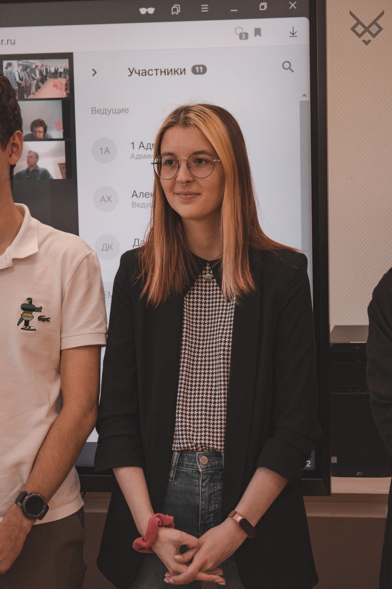

# Михайлова Александра Сергеевна

Женщина, 23 года, родилась 4 мая 2000

### Контакты

E-mail: <i>bonni_1998@mail.ru</i>

## Опыт работы 3 года 10 месяцев

- **УНИИСУ при Министерстве образования и науки РФ, Москва** (Февраль 2020 — по настоящее время)

  **Fullstack - разработчик**

  Разрабатывала системы с нуля, от проектирования архитектуры и схемы БД и до реализации frontend (с помощью html,
  css/scss, jquery или vue.js) и backend (c помощью php и фреймворка Yii2). В последнее время при реализации frontend
  использую компоненты фреймворка vuetify, переопределяя некоторые свойства классов, или использую фреймворк Tailwind
  CSS, реализуя собственные компоненты.

## Ключевые навыки

- PHP
- HTML
- MySQL
- JavaScript
- CSS
- jQuery
- Git
- SQL
- Linux
- HTML5
- CSS3
- Ajax
- ООП
- Bootstrap
- Работа в команде
- Java
- Python
- MS SQL
- MVC
- Работа с большим объемом информации
- Умение работать в команде
- Поиск информации в интернете

## Обо мне

Мои знания:

- PHP 7.3-8
- Composer
- Node.js (npm, nvm)
- Vue.js
- GitLab/GitHub
- Linux/Ubuntu (локальный сервер)
- Yii2
- css/scss
- Laravel

В процессе обучения работала с Docker, но опыта разработки с ним нет, так как на работе он не использовался.

## Высшее образование (Бакалавр)

- **Российский технологический университет, Москва**

  Институт информационных технологий, Программная инженерия (2022)

## Сертификаты

- [CCNA 7. Switching, Routing, and Wireless Essentials (SRWE) (Основы маршрутизации, коммутации и беспроводных сетей)](public/documents/certificates/-OST-2-MIREA-IKBO-certificate.pdf)
- [HTML-верстка: с нуля до первого макета](public/documents/certificates/certificate-html-layout-from-scratch-to-first-layout.pdf)
- [Адаптивная и мобильная верстка](public/documents/certificates/certificate-adaptive-and-mobile-layout.pdf)
- [Основы программирования](public/documents/certificates/certificate-basics-of-programming.pdf)
- [Git — система контроля версий](public/documents/certificates/certificate-git-version-control-system.pdf)
- [Основы JavaScript](public/documents/certificates/certificate-basics-of-javascript.pdf)
- [Основы JavaScript в браузере](public/documents/certificates/certificate-basics-of-javascript-in-browser.pdf)
- [Продвинутый JavaScript: современные возможности языка](public/documents/certificates/certificate-advanced-javascript-modern-language-features.pdf)
- [Продвинутый JavaScript в браузере](public/documents/certificates/certificate-advanced-javascript-in-browser.pdf)
- [React: Библиотека №1 в современной фронтенд-разработке](public/documents/certificates/certificate-react-1-library-in-modern-frontend-development.pdf)
